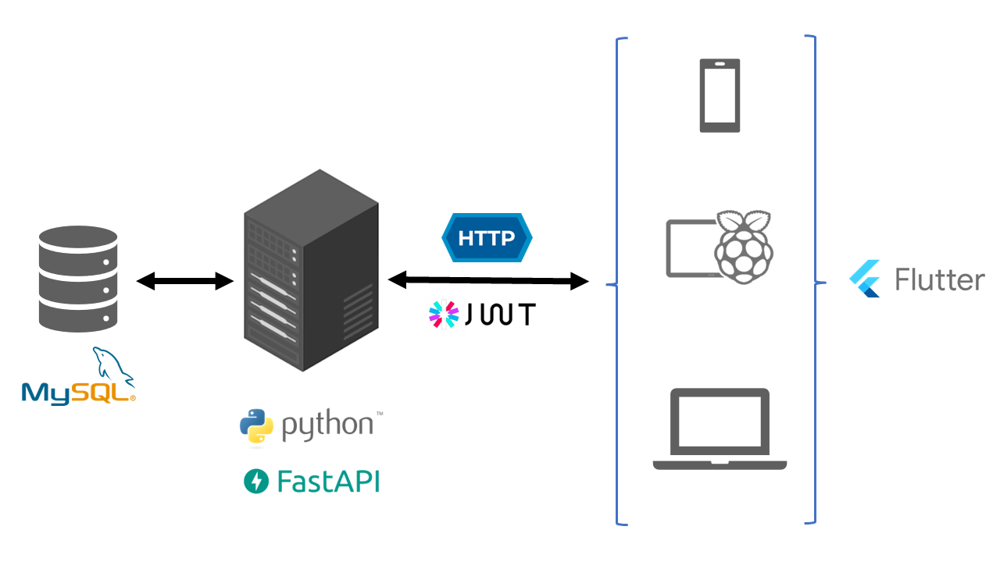

# polito-comm-systems-project

- [`DB`](./DB/) contains the `.sql` script to create the database and tables of the project (`plcs_db`).

- [`inventory-backend`](./inventory-backend/) contains the web service. Depending on your case, inside this directory you can execute one of the following scripts to launch the server:
    - [launch_server.sh](https://github.com/linomp/polito-comm-systems-project/blob/main/inventory-backend/launch_server.sh) - if you have a virtual environment (venv). It connects to our remote DB running on DigitalOcean.
    - [launch_server_no_venv.sh](https://github.com/linomp/polito-comm-systems-project/blob/main/inventory-backend/launch_server_no_venv.sh) - if you are using anaconda and not venv. It connects to our remote DB running on DigitalOcean.
    - [launch_server_local.sh](https://github.com/linomp/polito-comm-systems-project/blob/main/inventory-backend/launch_server_local.sh) - if you have a virtual environment (venv) and local MySQL installation with the `plcs_db` already in place.
    - [launch_server_no_venv_local.sh](https://github.com/linomp/polito-comm-systems-project/blob/main/inventory-backend/launch_server_no_venv_local.sh) - if you are using anaconda and not venv. Requires a local MySQL installation with the `plcs_db` already in place.

    If you are taking part in the web service development, to run the tests you can execute one of these:
    - [test_no_venv.sh](https://github.com/linomp/polito-comm-systems-project/blob/main/inventory-backend/launch_server_no_venv.sh) - if you are using anaconda and not venv. It connects to our remote DB running on DigitalOcean.
    - [test_no_venv_local.sh](https://github.com/linomp/polito-comm-systems-project/blob/main/inventory-backend/launch_server_no_venv_local.sh) - if you are using anaconda and not venv. Requires a local MySQL installation with the `plcs_db` already in place.
    
    
- [`raspberry-pi-scripts`](./raspberry-pi-scripts/) contains scripts to run in the rpi, e.g. nfc tag reading.

## Overall architecture of the app

